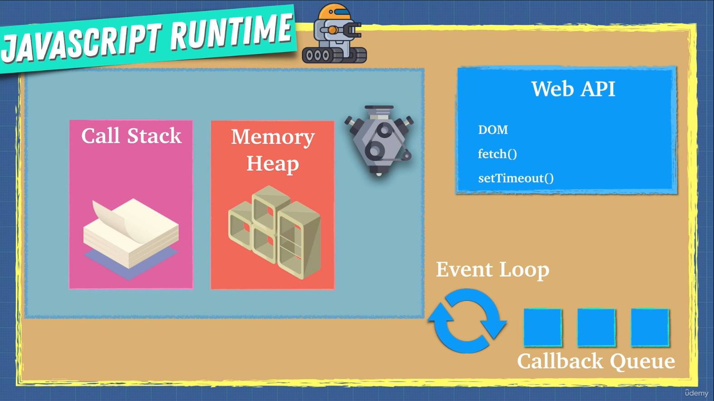

## Javascript runtime

"Javascript is a single threaded programming language. This means, that the execution of a program is dependant on the order of the statements. There's just one Call Stack and one Memory Heap."

True, but also misleading. Because the JS code runs within its environment. It might be on the server-side (Node.js), or the front-end side of a website, for instance, or even out of the web-dev environment. So, the JS Engine is, so to speak, GENERALLY not alone. Let's see the diagram:

We already know that the **JS Engine** interprets or compiles+executes your JS source code.

Can you imagine what would happen IF the browser just had the JS Engine, hence, just executed code in a single thread? You would just be able to run one program or one function at a time. Well, this is not the case AT ALL. While the synchronous Javascript code is running, the browser works on the background.

To do so, the browser makes use of the **Web API**. Accessing the `window` object with all its properties and methods (that run asynchronously) is just an example of a Web API that runs on the background. Okay, so, how are the Web API operations results added to the JS Engine's Call Stack?

Easy, that lands on **Callback Queue**'s duty.
The Callback Queue justL:

1. Holds the results (as callbacks) of the Web API operations in a Queue.
2. Waits for the JS Engine's Call Stack to be empty.
3. Adds the results to the Call Stack in order.
