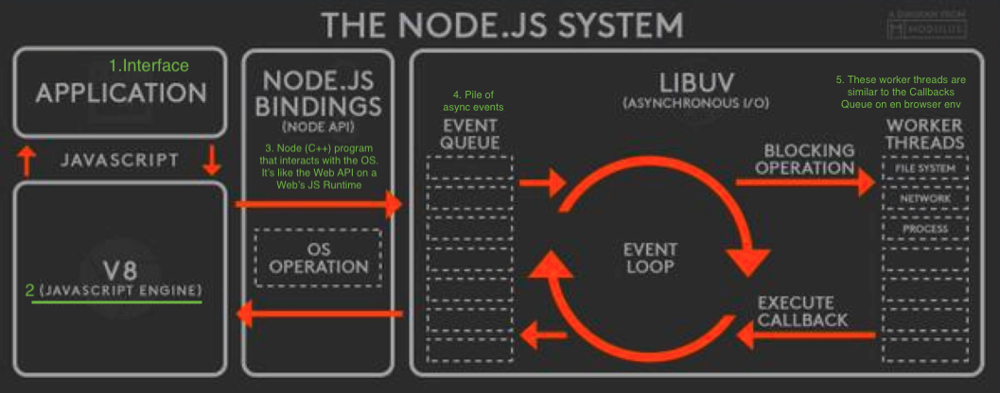

## Node

> Node.js is a JavaScript runtime built on Chrome's V8 JavaScript engine.

Node is a C++ program/executable that provides a JavaScript runtime for us.
As we see on the official diagram, the Node.js runtime is similar to the Web's Browser JS Runtime.

Node allows us to run JS code out of the browser, for example, on the server.

There are obviously some differences between the Browser's _sandboxed_ environment, and the Node.js env.

- On a browser you'll access the `window` object, while in Node, you'll have the `global` object.

[> Go to Index <](../README.md)
[< Prev: 3.2. The Callback queue](./the-callback-queue.md)
[Next: Foundation II. 1. Execution Context >](./execution-context.md)
