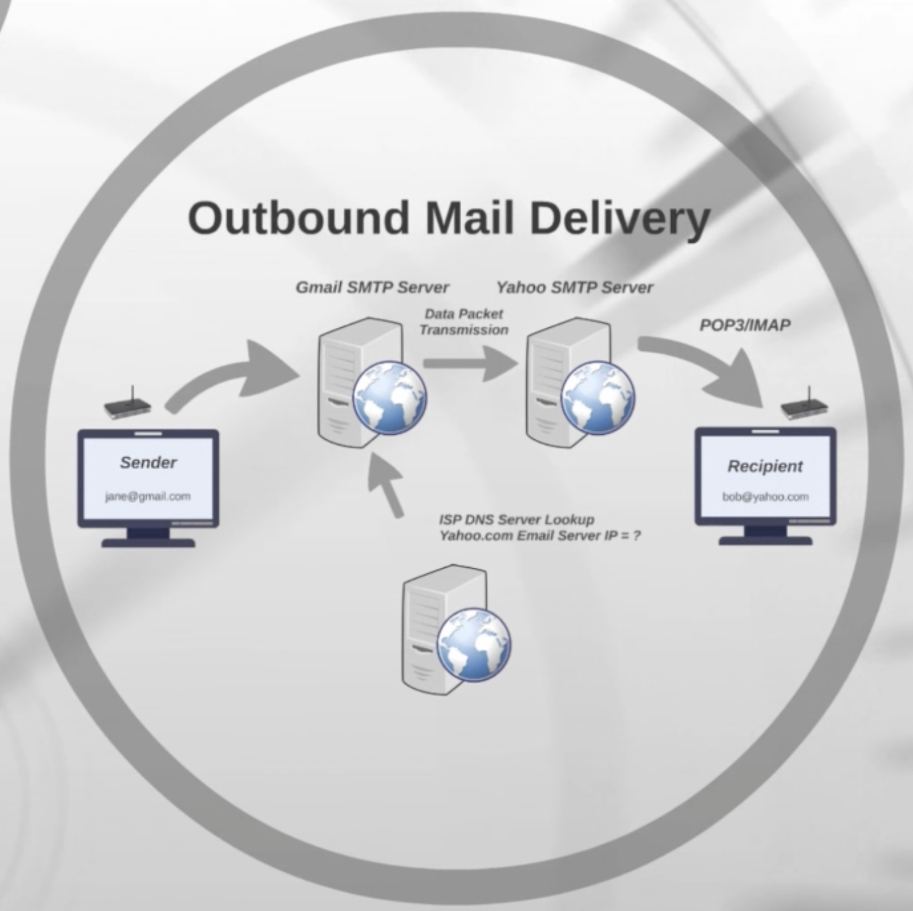

## The email delivery flow

First of all you need to know there are two types od Mail Delivery:

- Local delivery: When the sender and the receiver are exchanging emails or originating them from the same domain.

- Outbound delivery: The sender's domain is different from the recipient. Similar to the way your Internet Service Provider requests the website's IP to the DNS server, email providers request the receiver's IP address before sending it to the receiver's server.

Depending on the type of email exchange, the path to delivery will be quite different.

| Type of email exchange |                             Diagram                             |
| :--------------------: | :-------------------------------------------------------------: |
|     Local delivery     |         |
|   Outbound delivery    |  |

In any case, the email lives on the receiver's server until the next time they are connected to the email provider, so their emails are downloaded (using either POP3 or IMAP protocols).
