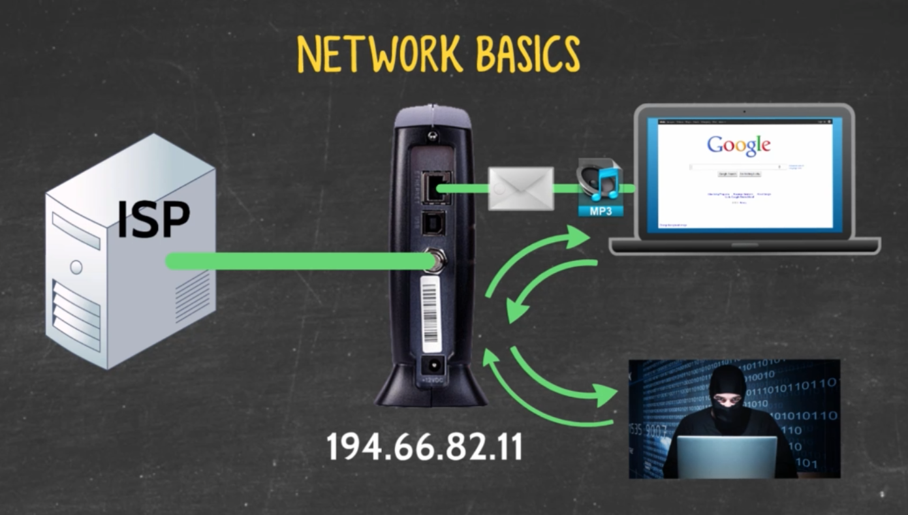

## Network Basics

It's time to take a look at the mechanisms that allow or restrict the movement of these packets using network routers, firewalls, import configurations, etc.

### The most basic setup

When we sign up with our local Internet Service Provider (ISP), we get a router that we can use to connect to the Internet. You can use a coaxial connection, a DSL phone line, or a cable modem. This allows us to transmit data packets over the Internet.

In this basic connection, the IP address assigned to the modem by our ISP would resolve directly to the computer.

There are some major issues related to the basic setup. The first and most important one is security. The second is network expand ability.

- **Security** Our complex software with all its applications is open to security vulnerabilities that can be exploited over an Internet connection. By connecting directly yo your modem, hackers can gain access to your computer.
- **Scalability** If just one computer is attached to one router, it can handle just one connection at a time.

### Adding the router to the setup for scalability

In order to split the connection, we would need a router. By connecting the modem to a router, all devices connected to the router can access the modem and therefore, the Internet. The router provides a local unique IP address to each connected device though they would still have the same external IP address (the modem's).

#### Local Area Networks (LANs)

A Local Area Network is a group of computers that share a common communications line within a relatively small area.

A LAN is typically confined to a single room, building or group of buildings.

#### Wide Area Network (WAN)

WANs are a more complex network that spans across much larger geographic areas, such as cities, states, or countries.
The Internet is the largest WAN in Existence.
