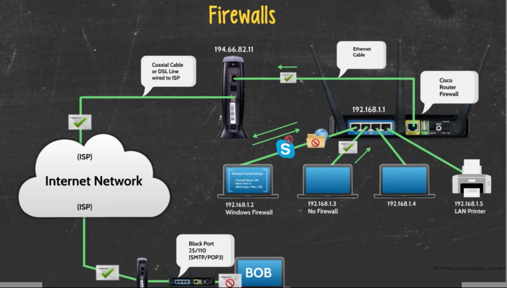

## Network ports

The router just not only allows you to connect multiple devices to the same network, but also enhances your network security.

Routers allow you to control the data packets that are allowed to enter your local network from the Internet. The reason is because all incoming and outgoing data packets must travel through designated ports on the router.

A **network port** can be thought as a data pipeline that is configured on your network's router ports. They can be opened or closed to allow or restrict the movement of data packets associated with various protocols (that we already know, like HTTP, SMTP, POP3, FTP, etc).

Port numbers are assigned a numerical value when created.

For example, the port number for the HTTP protocol is generally 80.
Port 25 is used for sending and receiving email.
Port 21 is used for FTP.

### Firewalls

Routers also have built-in firewalls. Firewalls can be configured to block or allow certain types of data packets.
